# AI CONTEXT - qgis-plugin-manager
Automatically generated by Ai-Context-Core

## 📁 PROJECT STRUCTURE

./
    .ai_context_cache.json
    .gitattributes
    .gitignore
    .pre-commit-config.yaml
    AI_CONTEXT.md
    CHANGELOG.md
    LICENSE
    ... (+11 more)
    src/
        qgis_manager/
            __init__.py
            cli.py
            config.py
            constants.py
            core.py
            dependencies.py
            discovery.py
            ... (+2 more)
            templates/
                default/
                    __init__.py.tmpl
                    metadata.txt.tmpl
                    plugin.py.tmpl
                processing/
                    provider.py.tmpl
                dockwidget/
            cli/
                __init__.py
                app.py
                base.py
                commands/
                    __init__.py
                    analyze.py
                    bump.py
                    clean.py
                    compile.py
                    deploy.py
                    hooks.py
                    ... (+3 more)
    tests/
        test_cli.py
        test_config.py
        test_core.py
        test_deployment_optimization.py
        test_discovery.py
        test_fix_exclusions.py
        test_hooks.py
        ... (+6

## 🎯 ENTRY POINTS

## 📈 COMPLEXITY AND METRICS
- **Total Modules**: 51
- **Source Lines (SLOC)**: 3,557
- **Total Physical Lines**: 5,388
- **Functions**: 0
- **Classes**: 0
- **Average Complexity**: 0.0
- **Avg Maintenance Index**: 0.0
- **Most Complex Modules**: src/qgis_manager/core.py, src/qgis_manager/validation.py, src/qgis_manager/ignore.py

## 🏗️ DETECTED PATTERNS
### Decorator
- **get_ignore_func** in `src/qgis_manager/ignore.py` (50%)
  - _Evidence: Function contains and returns inner 'ignore_func'_

## 🔗 PRIMARY DEPENDENCIES
### Third Party (most frequent):
- `qgis` (14 imports)
- `commands` (10 imports)
- `src` (9 imports)
- `core` (7 imports)
- `discovery` (5 imports)
- `config` (3 imports)
- `validation` (3 imports)
- `constants` (2 imports)
- `hooks` (2 imports)
- `ignore` (2 imports)
- `importlib_metadata` (2 imports)
- `__version__` (1 imports)
- `app` (1 imports)
- `base` (1 imports)
- `cli` (1 imports)

## 🕸️  DEPENDENCY STRUCTURE
- **Nodes**: 51
- **Edges**: 9
- **Density**: 0.004

## 🕸️ DEPENDENCY DIAGRAM (Conceptual)

```mermaid
graph TD
    test_cli --> py
    test_config --> py
    test_core --> py
    test_discovery --> py
    test_fix_exclusions --> py
    test_hooks --> py
    test_ignore --> py
    test_v061_patch --> py
    test_validation --> py
    classDef module fill:#f9f,stroke:#333,stroke-width:2px;
    eda_template
    class eda_template module;
    test_cli
    class test_cli module;
    test_hooks
    class test_hooks module;
    algorithm_template
    class algorithm_template module;
    dialog_template
    class dialog_template module;
    test_core
    class test_core module;
    test_validation
    class test_validation module;
    test_ignore
    class test_ignore module;
    validate_dataset
    class validate_dataset module;
    test_discovery
    class test_discovery module;
    test_config
    class test_config module;
    algorithm_template
    class algorithm_template module;
    bootstrap
    class bootstrap module;
    bootstrap
    class bootstrap module;
    test_fix_exclusions
    class test_fix_exclusions module;
    test_v061_patch
    class test_v061_patch module;
    generate_mock_data
    class generate_mock_data module;
    skill_sync
    class skill_sync module;
    eda_template
    class eda_template module;
    generator
    class generator module;
```

## 💡 OPTIMIZATION RECOMMENDATIONS
### src/qgis_manager/cli/commands/bump.py
- **complexity_refactoring**: Consider breaking down large logic
### src/qgis_manager/cli/commands/hooks.py
- **complexity_refactoring**: Consider breaking down large logic
### src/qgis_manager/ignore.py
- **complexity_refactoring**: Consider breaking down large logic
### src/qgis_manager/core.py
- **complexity_refactoring**: Consider breaking down large logic
- **module_too_large**: Large module (581 lines)
### src/qgis_manager/validation.py
- **complexity_refactoring**: Consider breaking down large logic

## 🔄 GIT AND EVOLUTION
### Top Hotspots:
- `src/qgis_manager/core.py` (19 commits)
- `src/qgis_manager/cli.py` (14 commits)
- `tests/test_core.py` (12 commits)
- `src/qgis_manager/discovery.py` (11 commits)
- `src/qgis_manager/validation.py` (7 commits)
### Recent Churn (30 days):
- Total lines changed: 25373

## 🔑 PROJECT KEYWORDS
- **Technologies**: .md, .py, .tmpl, .json, .yml, .toml, .zip, .tag
